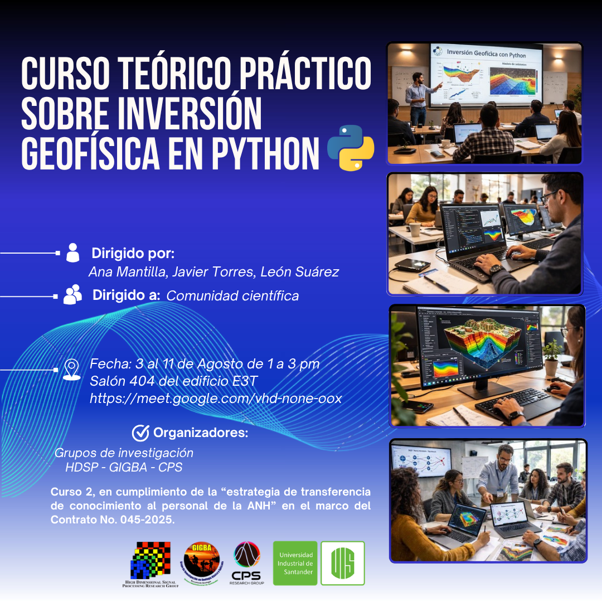
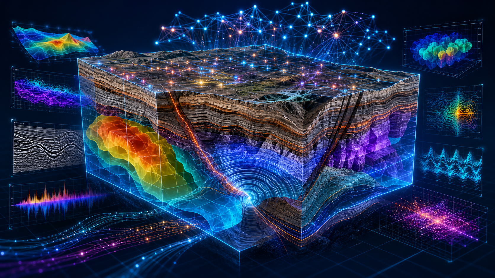

# Curso teórico práctico sobre inversión geofísica en Python

### Del dato observado al modelo del subsuelo

**Gravimetría · Magnetometría · MT 1D · FWI · SimPEG · Aprendizaje profundo guiado por física**

<em>Un laboratorio reproducible para explorar la relación</em>

$$
\mathbf{d} = \mathcal{F}(\mathbf{m}) + \boldsymbol{\varepsilon}
$$

<em>y reconstruir modelos físicos con ajuste de datos, regularización y aprendizaje profundo.</em>

## Qué encontrarás

Este repositorio reúne los materiales del **Curso teórico práctico sobre inversión geofísica en Python**, dirigido a la comunidad científica. Integra fundamentos del problema inverso con ejercicios guiados, casos sintéticos y datos reales.

El curso fue dirigido por **Ana Mantilla, Javier Torres y León Suárez**, con **PhD Henry Arguello Fuentes** como investigador principal. Fue organizado por los grupos de investigación **HDSP, GIGBA y CPS** en el marco del **Contrato No. 045-2025**, financiado por el Ministerio de Ciencia, Tecnología e Innovación (MINCIENCIAS) y la **Agencia Nacional de Hidrocarburos (ANH)**.

### Desarrollo del material

Los **códigos, notebooks y ejercicios prácticos** disponibles en este repositorio fueron desarrollados por:

- **Adrián Pérez-Montejo**, Geólogo
- **Kevin Tarazona**, BSc (c)

Repositorio del autor del material:

**[Adrián Pérez-Montejo — inversion-geofisica-python](https://github.com/alvercy/inversion-geofisica-python)**

Las personas encargadas de la dirección y dictado del curso se reconocen en la sección institucional y en `CITATION.cff`.

## Ruta científica

| Sesión | Eje | Del dato al modelo | Material | Video |
|:--:|---|---|:--:|:--:|
| 01 | Fundamentos | No unicidad, sensibilidad, incertidumbre y regularización | [Abrir](materials/session-01/) | [▶ Ver sesión](https://www.youtube.com/watch?v=gAqL1yqmJJw&list=PLBrkSquHNyNM&index=1) |
| 02 | Gravimetría 3D | Anomalía residual → contraste de densidad | [Abrir](materials/session-02/) | [▶ Ver sesión](https://www.youtube.com/watch?v=Yf4zvhu8cIk&list=PLBrkSquHNyNM&index=2) |
| 03 | Magnetometría 3D | Anomalía TMI → susceptibilidad magnética | [Abrir](materials/session-03/) | *No publicado* |
| 04 | MT 1D guiada por física | Impedancia Zxy → resistividad por capas | [Abrir](materials/session-04/) | [▶ Ver sesión](https://www.youtube.com/watch?v=SriI-fnhWYc&list=PLBrkSquHNyNM&index=3) |
| 05 | FWI: fundamentos | Registros sísmicos → modelo de velocidad | [Abrir](materials/session-05/) | [▶ Ver sesión](https://www.youtube.com/watch?v=zWDQ6DE8mWs&list=PLBrkSquHNyNM&index=4) |
| 06 | FWI: entrenamiento | *Shots* y pesos preentrenados → velocidad de onda P | [Abrir](materials/session-06/) | [▶ Ver sesión](https://www.youtube.com/watch?v=zzUrBL7tILg&list=PLBrkSquHNyNM&index=5) |
| 07 | Reto integrador MT 1D | Datos sintéticos → inversión profunda no supervisada | [Abrir](materials/session-07/) | *No publicado* |

> **Disponibilidad de videos:** la playlist pública contiene actualmente las grabaciones de las sesiones 1, 2, 4, 5 y 6. Esta tabla puede actualizarse cuando se publiquen las sesiones restantes.

## Arquitectura conceptual

  

La inversión se plantea como un **ciclo iterativo y auditable**: los datos observados y la hipótesis física alimentan el operador directo; la discrepancia entre datos predichos y observados se combina con regularización y conocimiento previo; el modelo se actualiza hasta alcanzar convergencia, y finalmente se evalúan resolución, incertidumbre y coherencia geológica.

## Clases grabadas

### ▶️ [Ver la lista de reproducción completa en YouTube](https://www.youtube.com/watch?v=gAqL1yqmJJw&list=PLBrkSquHNyNM)

*Revisa las sesiones en orden y utiliza los notebooks de este repositorio como laboratorio práctico.*

## Inicio rápido

    git clone https://github.com/Anagabrielamantilla/inversion-geofisica-python.git
    cd inversion-geofisica-python
    python -m venv .venv
    source .venv/bin/activate
    python -m pip install -r requirements.txt
    jupyter lab

Abre los notebooks desde su propia carpeta de sesión para conservar las rutas relativas a los datos. Varios cuadernos fueron diseñados para **Google Colab**; las celdas de montaje de Drive y las rutas `/content/...` deben ajustarse si se ejecutan localmente. Las tareas de FWI pueden requerir GPU y conjuntos externos indicados dentro de cada notebook.

## Estructura

    .
    ├── docs/
    │   ├── brochure.pdf          # pieza publicitaria y programa original
    │   └── assets/               # publicidad e infografía conceptual
    ├── materials/
    │   ├── session-01/           # introducción y regresión lineal
    │   ├── session-02/           # inversión gravimétrica
    │   ├── session-03/           # inversión magnetométrica
    │   ├── session-04/           # inversión MT 1D
    │   ├── session-05/           # introducción a FWI
    │   ├── session-06/           # FWI y modelos preentrenados
    │   └── session-07/           # reto de inversión MT 1D
    ├── CITATION.cff
    ├── LICENSE
    └── requirements.txt

## Programa anunciado

La pieza publicitaria presenta una intensidad total de **18 horas**:

- **Bloque 1 — Introducción al problema inverso (3 h):** datos, modelos, incertidumbre, problema directo, no unicidad, ruido, sensibilidad, ajuste y regularización.
- **Bloque 2 — Inversión gravimétrica con SimPEG (3 h):** malla 3D, celdas activas, modelos sintéticos, datos reales y visualización en ParaView.
- **Bloque 3 — Inversión magnetométrica con SimPEG (3 h):** TMI, campo inductor, susceptibilidad, casos sintéticos y reales.
- **Bloque 4 — Inversión profunda guiada por física para MT 1D (3 h):** operador directo diferenciable, MLP con *skip connections* y entrenamiento no supervisado.
- **Bloques 5 y 6 — Inversión de onda completa (6 h):** adquisición, ecuación de onda acústica, aprendizaje supervisado, hiperparámetros y pesos preentrenados.

Consulta el [folleto original](docs/brochure.pdf) para preservar la información institucional y el programa completo.

> **Nota histórica.** La publicidad anuncia el curso del **3 al 11 de agosto**, de **1:00 p. m. a 3:00 p. m.**, en el salón 404 del edificio E3T, con modalidad virtual complementaria. Los enlaces de asistencia e inscripción del evento se consideran históricos y no se reproducen como llamadas activas.

## Datos, reproducibilidad y alcance

- Los conjuntos `.npy`, `.txt` y `.edi` disponibles en la carpeta fuente se mantienen junto a su sesión.
- **Versión de SimPEG:** las salidas guardadas en los notebooks registran `0.25.1` en el ejercicio sintético de gravimetría y `0.25.2` en los ejercicios de gravimetría real y magnetometría. Para ofrecer un entorno común y reproducible, `requirements.txt` fija `simpeg==0.25.2`.
- Algunos notebooks hacen referencia a recursos externos o a nombres de archivos que no forman parte del paquete original; revisa sus celdas de preparación antes de ejecutar.
- Los resultados numéricos pueden variar por versión de biblioteca, *hardware*, semilla y tolerancias del optimizador.
- `requirements.txt` documenta el conjunto común de bibliotecas; cada notebook sigue siendo la referencia para requisitos específicos.

## Crédito institucional

Material asociado al proyecto **“Nuevas tecnologías computacionales para el procesamiento e inversión conjunta de gravimetría, magnetometría y magnetotelúrica mediante aprendizaje profundo guiado por principios físicos para la caracterización multicriterio”**.

### Dirección e investigación

El curso fue dirigido por:

- **Ana Mantilla**
- **Javier Torres**
- **León Suárez**

Con **PhD Henry Arguello Fuentes** como investigador principal.

### Desarrollo del material

Los códigos, notebooks y ejercicios prácticos fueron desarrollados por:

- **Adrián Pérez-Montejo**, Geólogo
- **Kevin Tarazona**, BSc (c)

### Organización e instituciones

Organizan: **HDSP · GIGBA · CPS**, con participación institucional de la **Universidad Industrial de Santander**.

Financian: **Ministerio de Ciencia, Tecnología e Innovación (MINCIENCIAS)** y **Agencia Nacional de Hidrocarburos (ANH)** a través del **Contrato No. 045-2025**.

## Uso y atribución

Este repositorio contiene **código, notebooks, material docente y datos asociados al curso**.

### Código y notebooks

El código fuente y los notebooks desarrollados para este repositorio se distribuyen bajo la **MIT License**, salvo que se indique expresamente lo contrario.

La MIT License permite utilizar, modificar y redistribuir estos componentes, siempre que se conserve el aviso de copyright y la licencia correspondiente.

### Material educativo

Los textos, figuras, esquemas y demás materiales educativos originales desarrollados para el curso se distribuyen bajo los términos de **Creative Commons Attribution 4.0 International (CC BY 4.0)**, salvo que se indique expresamente lo contrario.

Esta licencia permite compartir y adaptar el material siempre que se otorgue la atribución correspondiente.

### Datos y recursos de terceros

Los datos, imágenes, videos, bibliotecas y demás recursos pertenecientes a terceros conservan sus respectivas licencias y condiciones de uso. Su inclusión en este repositorio no implica que estén cubiertos por la MIT License o la CC BY 4.0.

Antes de reutilizar, modificar o redistribuir cualquier contenido, verifica la licencia correspondiente y conserva las atribuciones requeridas.

Para información sobre la citación académica del repositorio, consulta [`CITATION.cff`](CITATION.cff).

## Cómo citar

Si utilizas los códigos, notebooks o materiales desarrollados para este curso, se recomienda citar este repositorio y reconocer tanto a las personas encargadas de la dirección del curso como a los desarrolladores del material.

Una referencia general puede expresarse como:

> Mantilla, A., Torres, J., Suárez, L., Pérez-Montejo, A., & Tarazona, K. (2026). *Curso teórico práctico sobre inversión geofísica en Python*. Repositorio de materiales docentes.

Repositorio:

[https://github.com/Anagabrielamantilla/inversion-geofisica-python](https://github.com/Anagabrielamantilla/inversion-geofisica-python)

Repositorio del autor del material:

[https://github.com/alvercy/inversion-geofisica-python](https://github.com/alvercy/inversion-geofisica-python)

Para obtener la información bibliográfica completa, consulta [`CITATION.cff`](CITATION.cff).

---

**Explora · modela · invierte · valida**

